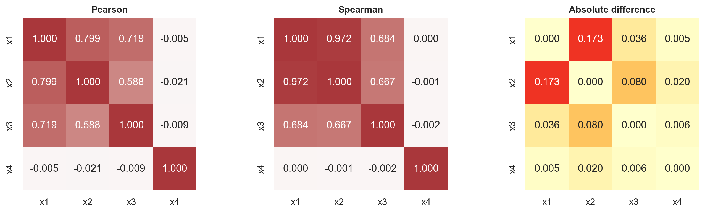

# Computational conventions

All predictions below are based only on the diagnostic information allowed in
the prompt: moments for Problem 1, the scatter plot for Problem 2, pair plots
for Problem 3, the covariance matrix for Problem 4, and the series/ACF/PACF for
Problem 5. The models were fit only after recording those predictions.

For Problem 1 I compute central moments using denominator $n$ and report
excess kurtosis, $m_4/m_2^2-3$, matching the course convention. For every model
comparison I use

$$
\operatorname{AICc}=2k-2\ell+
\frac{2k^2+2k}{n-k-1},
$$

where $\ell$ is the maximized log likelihood and $k$ counts every fitted
parameter, including the error-distribution parameters. Numerical values are
rounded in this document, while full precision is available in
`results.json` and the CSV files in `tables/`.

# Reading the Shape of a Sample

## Prediction from the first four moments

For the 1,000 observations in `problem1.csv`, the first four sample moments
are:

| Moment | Estimate |
|---|---:|
| Mean | 0.00110439 |
| Variance | 0.0000961520 |
| Standard deviation | 0.00980571 |
| Skewness | -0.668831 |
| Excess kurtosis | 2.339849 |

The sample is materially left-skewed and leptokurtic. Using only skewness and
excess kurtosis:

- **Normal is ruled out.** A Normal has skewness 0 and excess kurtosis 0, so
  both shape moments disagree with the sample.
- **Lognormal is ruled out.** A non-degenerate Lognormal has positive
  skewness, while this sample has negative skewness. This conclusion does not
  require using the support of the data.
- **Symmetric Student's $t$ is ruled out.** It can produce positive excess
  kurtosis, but its skewness is 0 whenever the skewness exists.
- **Normal inverse Gaussian (NIG) remains plausible.** Its skew parameter can
  produce negative skewness and it can also produce positive excess kurtosis.

This is a screening conclusion, not proof that the NIG generated the sample;
the first four moments do not uniquely identify a distribution.

## Normal fit and tail count

I matched the Normal mean and variance to the sample. Therefore

$$
X_{\text{Normal}}\sim N(0.00110439,\;0.0000961520).
$$

Its 1% quantile is **-0.0217071**. There are **26 observations** below that
threshold, whereas a correctly calibrated 1% quantile would produce
$1000(0.01)=\mathbf{10}$ observations on average.

{width=88%}

## Reconciliation

The fit confirms the moment-based warning. The observed lower-tail count is
2.6 times the Normal expectation. A symmetric Normal cannot allocate extra
mass specifically to the left tail, and zero excess kurtosis prevents it from
matching the sample's combination of a sharp center and heavy tails. Thus the
Normal understates the probability and severity of large negative outcomes.
For risk measurement this error is in the dangerous direction: a Normal-based
left-tail loss threshold would be too optimistic.

# A Regression Whose Errors Are Not Normal

## Prediction from the scatter plot

The scatter is centered on a strong, approximately linear relation with slope
near 3 and intercept near 1.5. Most observations form a tight band, but several
vertical deviations are far larger than a Normal cloud would suggest. The
spread looks broadly symmetric rather than one-sided, and there is no dominant
fan pattern. I therefore predict a **symmetric Student's $t$ error** with few
degrees of freedom rather than a Normal error.

This violates **OLS assumption 7: the error term is normally distributed**.
If assumptions 1--6 continue to hold, non-Normality does not create a
systematic bias in the OLS slope: OLS is still unbiased/consistent, although
it is more sensitive to extreme observations and is no longer the efficient
likelihood estimator for a $t$ error. Separately, the usual residual-variance
formula can still estimate the slope's conditional variance under independent,
homoskedastic finite-variance errors, but the exact small-sample Student-$t$
reference distribution for tests and intervals no longer follows. Heavy
outliers can also inflate the realized residual variance and make the reported
standard error unstable. I therefore expect the estimated slope to move only
modestly, while Normal-based inference and tail probabilities are less
trustworthy.

{width=100%}

## Fits and AICc

The fitted values are:

| Model | $\hat\alpha$ | $\hat\beta$ | Error scale | $\nu$ | AICc |
|---|---:|---:|---:|---:|---:|
| OLS | 1.560740 | 2.990757 | 1.351401 | -- | 692.145* |
| Normal MLE | 1.560740 | 2.990757 | 1.344627 | -- | 692.145 |
| Student-$t$ MLE | 1.547979 | 3.019179 | 0.935509 | 3.632163 | **665.327** |

For OLS, the standard errors are **0.096269** for $\hat\alpha$ and
**0.096640** for $\hat\beta$. Its error scale is the residual standard error
$\sqrt{\mathrm{SSE}/(n-2)}$. The Normal MLE uses
$\sqrt{\mathrm{SSE}/n}$, which explains the small scale difference. Normal MLE
and OLS have identical coefficient estimates because maximizing a Normal
regression likelihood over $\alpha$ and $\beta$ is equivalent to minimizing
SSE.

The Student-$t$ scale parameter is not its standard deviation. With
$\hat\nu=3.632163$, its implied standard deviation is 1.395562. The asterisk on
the OLS AICc indicates that distribution-free OLS has no likelihood and hence
no AICc of its own; the displayed value is obtained only after attaching the
fitted Normal likelihood, making it the Normal MLE comparison.

Student-$t$ improves AICc by **26.817** relative to Normal even after paying for
one additional parameter, so the Student-$t$ error model is strongly preferred.

## Reconciliation of slopes and error shape

The OLS/Normal slope is 2.990757 and the Student-$t$ slope is 3.019179, a
difference of only 0.028422 (about 0.95% of the OLS slope). The violation did
not move the slope much, consistent with the prediction that the conditional
mean is well specified and the main problem is the error distribution.

The rejected Normal model gets the **shape of the residual distribution**
wrong. To accommodate extreme errors with one scale parameter, it spreads too
much probability through the shoulders of the distribution, yet it still
assigns too little probability to the far tails and too little density to the
sharp central peak. This is why the likelihood strongly favors Student-$t$
even though the fitted regression lines are visually almost identical.

## Error quantiles and a capital buffer

| Upper-tail probability | Normal error quantile | Student-$t$ error quantile | Wider model |
|---:|---:|---:|---|
| 95.0% | 2.211715 | 2.053833 | Normal |
| 99.5% | 3.463530 | 4.620086 | Student-$t$ |

At 95%, the smaller fitted $t$ scale dominates, so the Student-$t$ quantile is
narrower. Farther into the tail, its power-law tail dominates and the 99.5%
quantile becomes much wider than the Normal quantile. For a capital buffer I
would use the **Student-$t$ model**, because a buffer is designed for rare,
severe outcomes, precisely where the Normal fit is too thin-tailed. The same
magnitudes apply to the lower tail with the sign reversed because both fitted
error distributions are symmetric.

# Pearson Against Spearman

## Prediction from all pair plots

{width=94%}

The $x_1$--$x_2$ pair should produce the largest disagreement. Its relation is
strongly monotone but visibly S-shaped/curved, so the ranks are nearly
preserved even though a straight line is not an exact summary. I expect
Spearman to be much higher than Pearson.

I expect the measures to agree most closely for every pair involving $x_4$,
because those clouds show no systematic relation and both measures should be
near zero. They should also be reasonably close for $x_1$--$x_3$, whose cloud
is approximately linear. The $x_2$--$x_3$ relation is monotone but inherits
curvature from $x_2$, so I expect a smaller version of the $x_1$--$x_2$ gap.

## Correlation matrices

Pearson correlation:

| | $x_1$ | $x_2$ | $x_3$ | $x_4$ |
|---|---:|---:|---:|---:|
| $x_1$ | 1.000 | 0.799 | 0.719 | -0.005 |
| $x_2$ | 0.799 | 1.000 | 0.588 | -0.021 |
| $x_3$ | 0.719 | 0.588 | 1.000 | -0.009 |
| $x_4$ | -0.005 | -0.021 | -0.009 | 1.000 |

Spearman correlation:

| | $x_1$ | $x_2$ | $x_3$ | $x_4$ |
|---|---:|---:|---:|---:|
| $x_1$ | 1.000 | 0.972 | 0.684 | 0.000 |
| $x_2$ | 0.972 | 1.000 | 0.667 | -0.001 |
| $x_3$ | 0.684 | 0.667 | 1.000 | -0.002 |
| $x_4$ | 0.000 | -0.001 | -0.002 | 1.000 |

{width=100%}

The largest absolute gap is for **$x_1$ and $x_2$**:

$$
|0.799092-0.971930|=\mathbf{0.172838}.
$$

## Reconciliation and mechanism

This matches the prediction. Pearson uses the original distances from the
means and measures **linear** co-movement. The strong curvature means one
straight-line slope cannot describe the entire $x_1$--$x_2$ relation, and the
large-magnitude $x_2$ observations receive substantial leverage. Spearman
first replaces values by ranks, discarding the nonlinear spacing while
preserving the nearly monotone ordering.

Spearman's 0.972 is the more honest answer to “how strongly do these variables
move monotonically together?” Pearson's 0.799 answers a different, still useful
question: “how much standardized linear covariance do these variables share?”
For a covariance matrix or a linear hedge, Pearson is the relevant quantity;
for the strength of this nonlinear dependence, Spearman is more descriptive.

# Conditional Distributions

## Prediction from the covariance matrix

The sample mean vector and covariance matrix are

$$
\hat\mu=
\begin{bmatrix}-0.016714\\0.045288\end{bmatrix},\qquad
\hat\Sigma=
\begin{bmatrix}
1.099875 & 1.696902\\
1.696902 & 4.104749
\end{bmatrix}.
$$

I define $\Sigma_{11}=\operatorname{Var}(x_1)$,
$\Sigma_{22}=\operatorname{Var}(x_2)$,
$\Sigma_{12}=\operatorname{Cov}(x_1,x_2)$, and
$\Sigma_{21}=\Sigma_{12}'$. Thus $x_1$ is the observed/conditioning block and
$x_2$ is the target block. Under the multivariate Normal,

$$
\operatorname{Var}(x_2\mid x_1)
=\Sigma_{22}-\Sigma_{21}\Sigma_{11}^{-1}\Sigma_{12}.
$$

The conditional-to-unconditional variance factor is

$$
\frac{\Sigma_{22}-\Sigma_{21}\Sigma_{11}^{-1}\Sigma_{12}}
{\Sigma_{22}}
=1-\frac{\Sigma_{21}\Sigma_{11}^{-1}\Sigma_{12}}{\Sigma_{22}}
=\mathbf{0.362201}.
$$

Learning $x_1$ therefore reduces the variance of $x_2$ to 36.22% of its
unconditional value, a 63.78% reduction. In standard-deviation units the
factor is $\sqrt{0.362201}=0.601832$.

Under the multivariate Normal, this factor **does not depend on the observed
value of $x_1$**. The conditional variance formula contains only covariance
blocks; unlike the conditional mean formula, it contains no term involving
the realized $x_1$.

## Conditional mean, band, and coverage

The conditional mean is

$$
E[x_2\mid x_1]
=\mu_2+\Sigma_{21}\Sigma_{11}^{-1}(x_1-\mu_1).
$$

For this sample,

$$
\widehat{E[x_2\mid x_1]}
=0.045288+1.542813(x_1+0.016714)
=\mathbf{0.071073+1.542813x_1}.
$$

The coefficient $\Sigma_{21}\Sigma_{11}^{-1}=1.542813$ is exactly the OLS
slope from regressing $x_2$ on $x_1$ with an intercept. The fitted conditional
variance is 1.486746, so the conditional standard deviation is 1.219322. I drew
the 95% band as the fitted conditional mean plus or minus
$1.959964(1.219322)$.

{width=91%}

Overall, **935 of 1,000 observations**, or **93.5%**, fall inside the band.

| Distance of $x_1$ from its mean | Observations | Inside | Coverage | Residual SD |
|---|---:|---:|---:|---:|
| Within 1 SD | 759 | 726 | 95.65% | 1.0758 |
| Between 1 and 2 SD | 190 | 163 | 85.79% | 1.5804 |
| Beyond 2 SD | 51 | 46 | 90.20% | 1.5957 |

## Reconciliation and failed assumption

Coverage is close to nominal near the center but substantially lower away
from the center. The residual standard deviation rises from about 1.08 in the
central bucket to about 1.58--1.60 in the two outer buckets. Thus the data are
**heteroskedastic**: $\operatorname{Var}(x_2\mid x_1)$ changes with the location
of $x_1$. This violates the multivariate-Normal implication of a constant
conditional covariance, so a single constant-width band cannot be calibrated
equally across the range of $x_1$.

Some parts of the conditional-mean calculation survive. The coefficient
$\Sigma_{21}\Sigma_{11}^{-1}$ remains the population/sample **best linear
projection coefficient** without joint Normality, and the plotted line remains
a useful linear summary if the conditional mean is in fact linear. What no
longer follows automatically is that this line is the exact conditional
expectation at every $x_1$. More clearly, the constant conditional variance,
the constant band width, the exact Normal conditional distribution, and exact
95% coverage do not survive. The 0.3622 variance factor should therefore be
interpreted as a pooled linear-projection variance reduction rather than a
universal conditional-uncertainty factor for every observed $x_1$.

# Identifying an AR or MA Order

## Prediction from the series, ACF, and PACF

The series fluctuates around a stable mean near 0.67 without a trend. Using the
course significance band,

$$
\pm\frac{1.96}{\sqrt{500}}=\mathbf{\pm0.087654}.
$$

The ACF has a large positive lag 1 (0.462), is near zero at lag 2, becomes
negative at lags 3--4, and later returns toward positive values. That is a
damped, oscillating **decay**, not a clean cutoff. The PACF has decisive spikes
at lags 1 (0.462) and 2 (-0.303), then is mostly inside the band. I therefore
predict an **AR(2)** process: for AR($p$), the ACF decays and the PACF cuts off
after lag $p$; for MA($q$), those roles reverse.

There is an isolated PACF exceedance at lag 9. I do not treat one late spike as
a new cutoff: when 20 lags are compared with individual 5% bands, roughly one
false exceedance is expected by chance even if the later true PACFs are zero.

{width=88%}

## Model fits and AICc selection

Every model includes a constant and a Gaussian innovation variance. The exact
state-space maximum-likelihood fits give:

| Model | $k$ | Log likelihood | AICc |
|---|---:|---:|---:|
| AR(1) | 3 | -706.2693 | 1418.5870 |
| AR(2) | 4 | -682.1788 | **1372.4383** |
| AR(3) | 5 | -682.1109 | 1374.3432 |
| MA(1) | 3 | -691.5179 | 1389.0843 |
| MA(2) | 4 | -686.5754 | 1381.2316 |
| MA(3) | 5 | -681.9975 | 1374.1165 |

AICc selects **AR(2)**, matching the prediction. Its fitted model is

$$
(x_t-0.670607)=0.601201(x_{t-1}-0.670607)
-0.302638(x_{t-2}-0.670607)+\epsilon_t,
$$

with innovation variance 0.895802.

## AR(2) versus AR(3)

AR(3) estimates coefficients 0.596203, -0.292690, and **-0.016542**. The third
coefficient is very small. Adding it improves the log likelihood by only
$-682.1109-(-682.1788)=0.0679$, while it adds one fitted parameter. The tiny fit
gain cannot repay AICc's complexity penalty, so AICc rises from 1372.4383 to
1374.3432 and rejects AR(3).

Ordinary $R^2$ would not make the same tradeoff. Adding another lag enlarges the
regressor set, so in-sample SSE cannot increase and $R^2$ cannot decrease, even
when the added coefficient is fitting noise. AICc explicitly charges for the
extra parameter and therefore favors the more parsimonious AR(2).

# Reproducibility

All calculations and figures are generated by `analysis.py`. The accompanying
`README.md` gives the exact environment setup and commands needed to reproduce
every reported result and rebuild this PDF.
