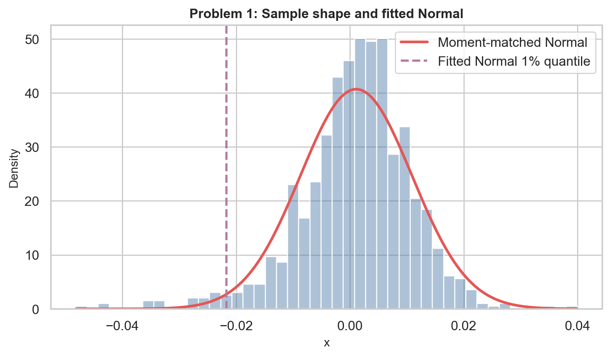
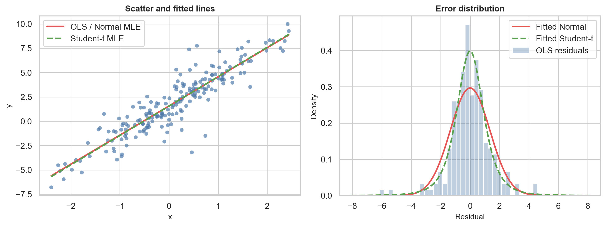
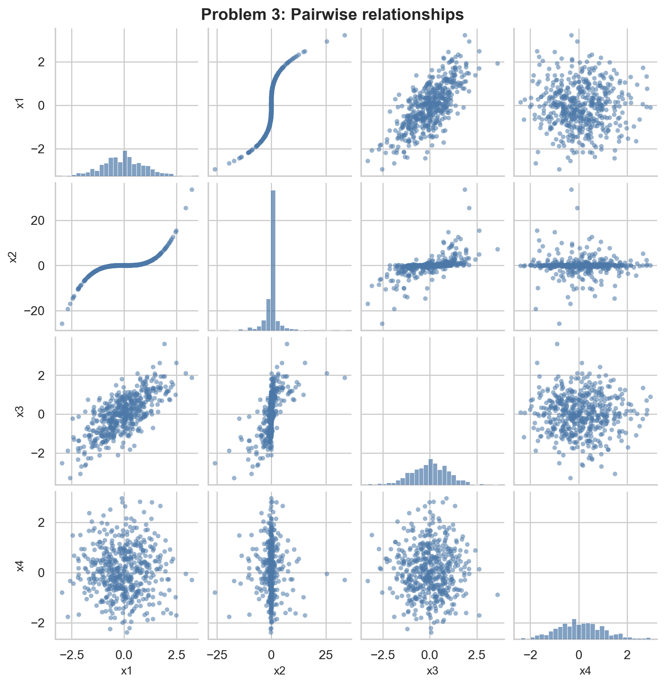
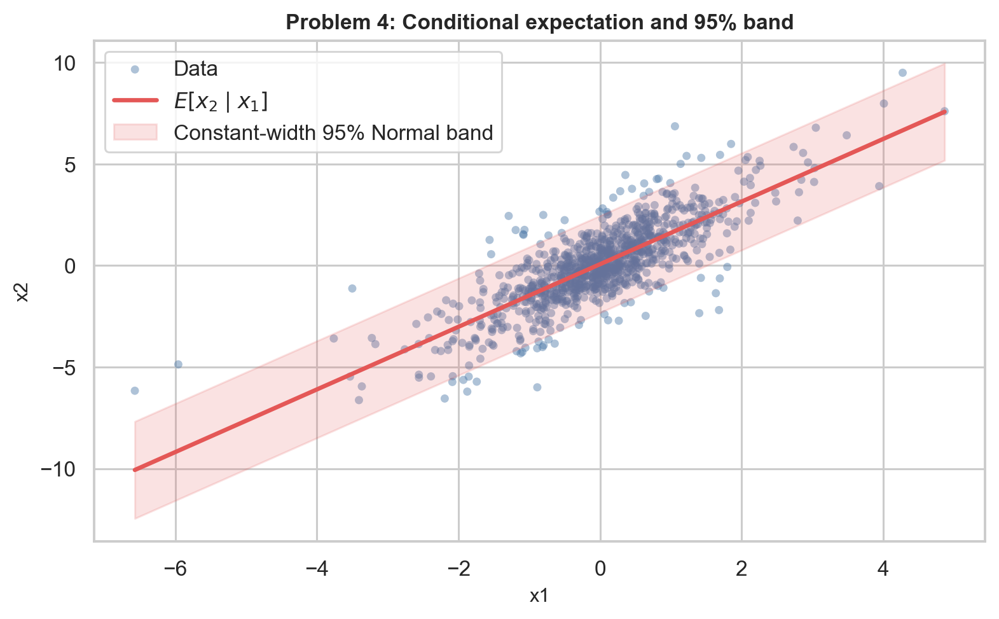
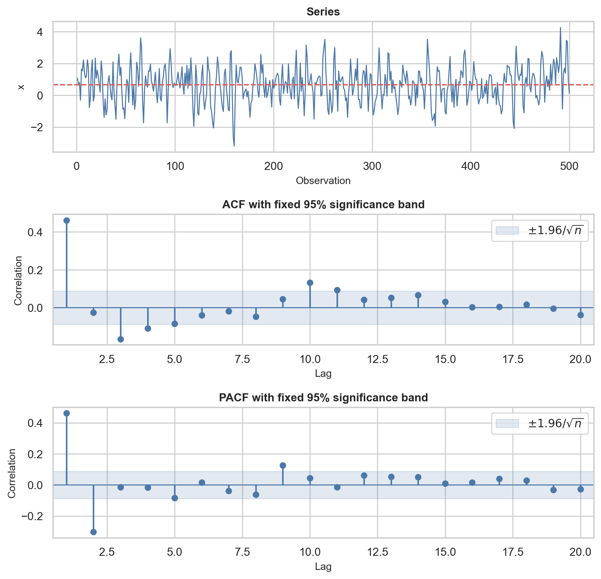

For the moment calculations, I use denominator $n$ and report excess kurtosis.
For model comparisons, I use
$\operatorname{AICc}=\operatorname{AIC}+(2k^2+2k)/(n-k-1)$.

# Problem 1: Reading the Shape of a Sample

## Prediction

The first four sample moments are:

| Moment | Value |
|---|---:|
| Mean | 0.001104 |
| Variance | 0.00009615 |
| Skewness | -0.6688 |
| Excess kurtosis | 2.3398 |

The negative skewness means the sample has a longer left tail. The positive
excess kurtosis means it has heavier tails than a Normal distribution.

- **Normal:** ruled out because its skewness and excess kurtosis are both 0.
- **Lognormal:** ruled out because its skewness should be positive.
- **Student's $t$:** ruled out because it is symmetric and has zero skewness.
- **NIG:** plausible because it can have negative skewness and positive excess
  kurtosis.

## Fit and reconcile

The fitted Normal has mean 0.001104 and standard deviation 0.009806. Its 1%
quantile is **-0.021707**. There are **26 observations** below this number. A
correctly fitted 1% quantile should have about $1000(0.01)=\mathbf{10}$
observations below it.

{width=78%}

The result agrees with my prediction. The sample has 2.6 times as many lower
tail observations as the Normal model expects. The Normal model misses the
negative skewness and heavy tails, so it underestimates large negative values.

# Problem 2: Regression with Non-Normal Errors

## Prediction

The scatter plot shows a clear linear relationship with a few large vertical
errors. Most points are close to the line, but a small number are far away. I
expect a Student's $t$ error because it allows more extreme errors than a
Normal distribution.

This violates OLS assumption 7: the errors are normally distributed. If the
other OLS assumptions hold, I do not expect a large or systematic change in
the slope. However, the usual Normal-based tests and confidence intervals are
less reliable, and large errors can make the reported standard error unstable.

{width=96%}

## Fit and reconcile

| Model | $\alpha$ | $\beta$ | Error fit | AICc |
|---|---:|---:|---|---:|
| OLS | 1.5607 | 2.9908 | residual SD = 1.3514 | -- |
| Normal MLE | 1.5607 | 2.9908 | $\sigma=1.3446$ | 692.145 |
| Student's $t$ MLE | 1.5480 | 3.0192 | scale = 0.9355, $\nu=3.6322$ | **665.327** |

The OLS standard errors are 0.0963 for $\alpha$ and 0.0966 for $\beta$. OLS and
Normal MLE give the same coefficients because both minimize squared errors.
OLS by itself does not have an AICc because it does not specify an error
distribution.

The Student's $t$ AICc is lower by 26.817, so it is strongly preferred. The
slopes are still very close: 2.9908 versus 3.0192. This agrees with my
prediction that non-Normal errors would not change the slope very much. The
Normal model mainly gets the error shape wrong. It cannot fit both the sharp
center and the extreme residuals.

| Quantile | Normal error | Student's $t$ error |
|---|---:|---:|
| 95% | 2.2117 | 2.0538 |
| 99.5% | 3.4635 | 4.6201 |

At 95%, the fitted Normal is wider because the fitted $t$ has a smaller scale.
At 99.5%, the heavy tail of the $t$ becomes more important, so the $t$ is much
wider. I would use the Student's $t$ model for a capital buffer because capital
is intended to protect against rare, extreme losses.

# Problem 3: Pearson and Spearman Correlation

## Prediction

{width=82%}

The $x_1,x_2$ plot has a strong monotonic but curved relationship. I expect
Spearman to be higher than Pearson for this pair. The $x_1,x_3$ relationship
looks approximately linear, so the two measures should be closer. Every pair
with $x_4$ looks unrelated, so both measures should be near 0.

## Fit and reconcile

Pearson correlation:

| | $x_1$ | $x_2$ | $x_3$ | $x_4$ |
|---|---:|---:|---:|---:|
| $x_1$ | 1.000 | 0.799 | 0.719 | -0.005 |
| $x_2$ | 0.799 | 1.000 | 0.588 | -0.021 |
| $x_3$ | 0.719 | 0.588 | 1.000 | -0.009 |
| $x_4$ | -0.005 | -0.021 | -0.009 | 1.000 |

Spearman correlation:

| | $x_1$ | $x_2$ | $x_3$ | $x_4$ |
|---|---:|---:|---:|---:|
| $x_1$ | 1.000 | 0.972 | 0.684 | 0.000 |
| $x_2$ | 0.972 | 1.000 | 0.667 | -0.001 |
| $x_3$ | 0.684 | 0.667 | 1.000 | -0.002 |
| $x_4$ | 0.000 | -0.001 | -0.002 | 1.000 |

The largest gap is for $x_1,x_2$:
$|0.7991-0.9719|=\mathbf{0.1728}$. This matches my prediction. Spearman is more
honest if the question is whether the variables move in the same direction,
because it measures monotonic rank dependence. Pearson answers how strong the
linear relationship is. The curved shape makes Pearson lower even though the
variables are strongly related.

# Problem 4: Conditional Distributions

## Prediction

The sample covariance matrix is

$$
\hat\Sigma=
\begin{bmatrix}
1.099875 & 1.696902\\
1.696902 & 4.104749
\end{bmatrix}.
$$

I use $\Sigma_{11}=\operatorname{Var}(x_1)$,
$\Sigma_{22}=\operatorname{Var}(x_2)$, and the off-diagonal blocks for the
covariance. The conditional variance is

$$
\operatorname{Var}(x_2\mid x_1)
=\Sigma_{22}-\Sigma_{21}\Sigma_{11}^{-1}\Sigma_{12}
=1.486746.
$$

The conditional-to-unconditional variance factor is

$$
\frac{\Sigma_{22}-\Sigma_{21}\Sigma_{11}^{-1}\Sigma_{12}}
{\Sigma_{22}}=\mathbf{0.3622}.
$$

Therefore, learning $x_1$ reduces the variance of $x_2$ to 36.22% of its
original value. Under the multivariate Normal, this factor does not depend on
the observed value of $x_1$, because $x_1$ does not appear in the conditional
variance formula.

## Fit and reconcile

The conditional mean is

$$
E[x_2\mid x_1]
=\mu_2+\Sigma_{21}\Sigma_{11}^{-1}(x_1-\mu_1)
=0.071073+1.542813x_1.
$$

The coefficient 1.542813 is also the OLS slope from regressing $x_2$ on $x_1$.
The conditional standard deviation is 1.219322, which gives the constant-width
95% band shown below.

{width=82%}

Overall, **935 of 1,000 observations**, or **93.5%**, fall inside the band.

| Distance of $x_1$ from its mean | Observations | Coverage |
|---|---:|---:|
| Within 1 SD | 759 | 95.65% |
| Between 1 and 2 SD | 190 | 85.79% |
| Beyond 2 SD | 51 | 90.20% |

Coverage is lower away from the center. The residual standard deviation is
about 1.08 in the middle and about 1.58 to 1.60 in the outer groups. This means
the conditional variance is not constant, so the data do not satisfy the
constant conditional variance implied by a multivariate Normal distribution.

The slope still works as the best linear regression coefficient. However, the
constant band width and exact 95% Normal coverage do not remain valid. Without
joint Normality, the line is also not guaranteed to be the exact conditional
mean, although it is still a useful linear fit.

# Problem 5: Identifying an AR or MA Order

## Prediction

The series looks stationary around a constant mean. The 95% significance band
is

$$
\pm\frac{1.96}{\sqrt{500}}=\pm0.08765.
$$

The ACF decays with an oscillating pattern. The PACF has large spikes at lags 1
and 2 and is mostly inside the band after lag 2. The rule is:

- AR($p$): ACF decays and PACF cuts off after lag $p$.
- MA($q$): ACF cuts off after lag $q$ and PACF decays.

Based on this rule, I predict an **AR(2)** process. The isolated PACF spike at
lag 9 is likely sampling noise rather than a new cutoff.

{width=82%}

## Fit and reconcile

| Model | AICc |
|---|---:|
| AR(1) | 1418.5870 |
| AR(2) | **1372.4383** |
| AR(3) | 1374.3432 |
| MA(1) | 1389.0843 |
| MA(2) | 1381.2316 |
| MA(3) | 1374.1165 |

AICc selects AR(2), so the fitted result matches my prediction. The AR(2)
coefficients are 0.6012 and -0.3026.

For AR(3), the third coefficient is only -0.0165. It improves the fit very
little, but AICc adds a penalty for the extra parameter. Therefore, AICc
prefers AR(2). Ordinary $R^2$ does not include this penalty and cannot decrease
when another variable or lag is added, so it would not make the same choice.
